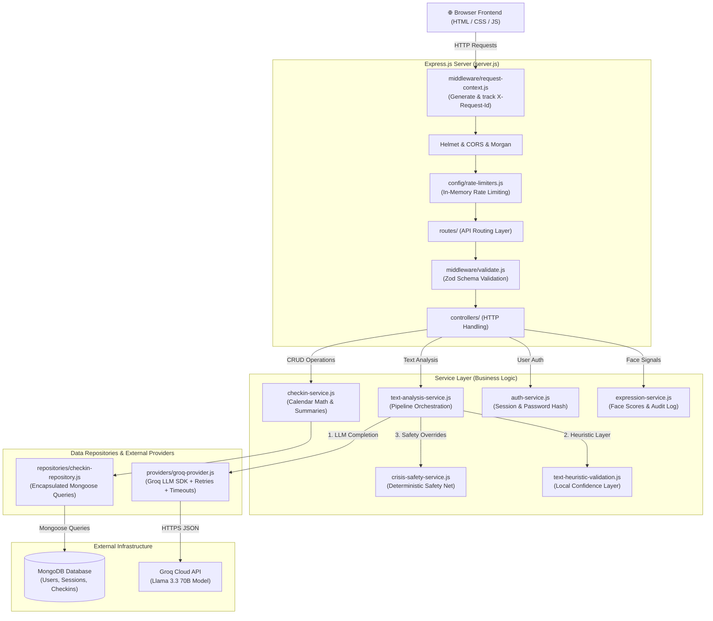

# SafeSpace.ai

SafeSpace.ai is a privacy-conscious, multi-modal emotional interpretation platform and wellness dashboard. It combines written emotional check-ins, optional webcam-based facial expression signals, mood tracking, saved check-in history, supportive recommendations, and a deterministic crisis safety net.

The application is built with a Node.js/Express backend using a clean **Controller-Service-Repository-Provider** architecture, MongoDB persistence via Mongoose, Zod request & environment validation, Groq LLM integration with safe fallback paths, Pino structured logging, and a responsive vanilla HTML/CSS/JavaScript frontend.

---

## 🏛️ System Architecture



---

## 🚀 Key Architectural Highlights

* **Decoupled Layered Design**: Separates HTTP handling (`controllers/`), input validation (`validation/`), business logic (`services/`), database access (`repositories/`), and LLM execution (`providers/`).
* **Zod Boundary & Boot Validation**: 
  * Boot-time schema validation (`backend/config/env.js`) validates environment variables on startup and fails fast if invalid types are provided.
  * Request validation middleware (`backend/middleware/validate.js`) rejects bad client payloads (malformed emails, text length exceeding 2000 chars) at the HTTP boundary.
* **LLM Provider Abstraction (`LLMProvider`)**: Text analysis is isolated behind `groq-provider.js`. Groq SDK calls, network timeouts, transient retries (429/503), and system prompts are fully modular, allowing seamless provider swapping.
* **Deterministic Crisis Safety Net**: Immediate detection of self-harm or severe distress signals (`crisis-safety-service.js`). Bypasses or overrides LLM output to enforce high-risk classifications and attach emergency guidance (e.g. Tele-MANAS helpline).
* **Repository Pattern**: All `Checkin` Mongoose model interactions are contained in `backend/repositories/checkin-repository.js`, leaving `checkin-service.js` focused purely on business logic, pagination, and calendar range math.
* **Structured Pino Logging**: Logs output structured JSON with `requestId` correlation, auto-formatting with `pino-pretty` in local development.

---

## 📦 Project Structure

```text
├── server.js                          # Express app initialization, middleware, static server
├── package.json
├── README.md
├── frontend/
│   ├── index.html                     # App layout and UI structure
│   ├── styles.css                     # Responsive visual design system
│   └── app.js                         # Frontend state, API calls, charts, webcam flow
└── backend/
    ├── config/
    │   ├── env.js                     # Zod boot-time environment variable validation
    │   ├── db.js                      # MongoDB connection management & health status
    │   ├── rate-limiters.js           # API, auth, and analysis rate limiting configs
    │   └── server-info.js             # Session & boot metadata
    ├── controllers/
    │   ├── auth.controller.js         # Register, login, logout, getMe handlers
    │   ├── checkin.controller.js      # List check-ins, create check-in handlers
    │   ├── text.controller.js         # Text analysis endpoint & text service health
    │   ├── expression.controller.js   # Expression analysis endpoint & expression health
    │   └── health.controller.js       # Live, ready, health, and metrics endpoints
    ├── routes/
    │   ├── index.js                   # API route aggregation
    │   ├── auth.routes.js             # Auth endpoints (/api/auth/*)
    │   ├── checkin.routes.js          # Check-in endpoints (/api/checkins)
    │   ├── text.routes.js             # Text endpoints (/api/text/*)
    │   ├── expression.routes.js       # Expression endpoints (/api/expression/*)
    │   └── health.routes.js           # Health & metrics endpoints
    ├── validation/
    │   └── schemas.js                 # Zod schemas for request validation
    ├── middleware/
    │   ├── validate.js                # Zod request validation middleware
    │   ├── error-handler.js           # Centralized API error handling
    │   ├── rate-limit.js              # In-memory sliding window rate limiter
    │   ├── request-context.js         # Request ID generation & X-Request-Id header
    │   ├── require-auth.js            # Bearer token authentication guard
    │   ├── require-db.js              # Database readiness guard
    │   └── require-internal-access.js # Restricted metrics access guard
    ├── repositories/
    │   └── checkin-repository.js      # Encapsulated Mongoose queries for Checkin model
    ├── providers/
    │   ├── llm-provider.js            # JSDoc interface definition for LLM providers
    │   └── groq-provider.js           # Groq LLM integration (SDK, retries, timeouts)
    ├── utils/
    │   ├── request-helpers.js         # IP extraction & bearer token parsing
    │   └── request-logger.js          # Pino child logger with requestId correlation
    ├── __tests__/                     # Automated test suite (Node.js test runner)
    │   ├── crisis-safety-service.test.js
    │   ├── text-heuristic-validation.test.js
    │   ├── checkin-service.test.js
    │   └── validation.test.js
    ├── text-analysis-service.js       # Core text interpretation pipeline
    ├── crisis-safety-service.js       # Crisis & safety threshold evaluation
    ├── text-heuristic-validation.js   # Local heuristic confidence refinement
    ├── checkin-service.js             # Check-in pagination, summaries, calendar math
    ├── auth-service.js                # User creation, scrypt hashing, session tokens
    ├── expression-service.js          # Expression score normalization & audit logging
    ├── logger.js                      # Pino logger instance
    └── models/                        # Mongoose schemas (User, Session, Checkin)
```

---

## ⚙️ Environment Variables

Create a `.env` file in the project root:

```env
PORT=3000
NODE_ENV=development
MONGODB_URI=mongodb://localhost:27017/safespace
GROQ_API_KEY=your_groq_api_key_here
```

### Optional Configuration

```env
GROQ_MODEL=llama-3.3-70b-versatile
GROQ_TIMEOUT_MS=15000
MONGODB_CONNECT_TIMEOUT_MS=5000
MONGODB_MAX_POOL_SIZE=20
MONGODB_MIN_POOL_SIZE=0
API_RATE_LIMIT_WINDOW_MS=60000
API_RATE_LIMIT_MAX=180
AUTH_RATE_LIMIT_WINDOW_MS=900000
AUTH_RATE_LIMIT_MAX=20
ANALYSIS_RATE_LIMIT_WINDOW_MS=60000
ANALYSIS_RATE_LIMIT_MAX=60
LOG_LEVEL=info
ALLOWED_ORIGINS=http://localhost:3000
```

*Note: `MONGODB_URI` and `GROQ_API_KEY` are optional. The server supports **degraded mode**—if MongoDB is unavailable or `GROQ_API_KEY` is omitted, the app will still boot and serve public endpoints or return safe heuristic fallback responses.*

---

## 🛠️ How To Run & Test

### Installation

```bash
npm install
```

### Running the App

```bash
npm start
```

Open `http://localhost:3000` in your web browser.

### Running Automated Tests

Run the automated test suite powered by the Node.js native test runner:

```bash
npm test
```

---

## 🔌 API Endpoints Summary

### Health & Diagnostics
* `GET /api/live` — Liveness check
* `GET /api/ready` — Readiness check (DB connection check)
* `GET /api/health` — Full health status
* `GET /api/metrics` — Server metrics (Restricted access)
* `GET /api/text/health` — Text service health & LLM model metadata
* `GET /api/expression/health` — Expression service health

### Analysis
* `POST /api/text/analyze` — Analyze emotional check-in text
* `POST /api/expression/analyze` — Process facial expression signals

### Authentication
* `POST /api/auth/register` — Register a new account
* `POST /api/auth/login` — Log in and obtain session token
* `GET /api/auth/me` — Fetch current user details
* `POST /api/auth/logout` — Invalidate session token

### Check-ins (Authenticated)
* `GET /api/checkins` — List user check-ins (supports pagination, filtering & month calendar)
* `POST /api/checkins` — Save a new check-in entry

---

## ⚠️ Responsible AI Note

This application is designed for emotional support, self-reflection, and early awareness only. It is **not** a medical device, clinical diagnostic tool, or substitute for professional healthcare. The safety layer includes automated routing to crisis resources (such as **Tele-MANAS** 14416 in India); however, high-risk safety features should undergo clinical review prior to real-world deployment.
